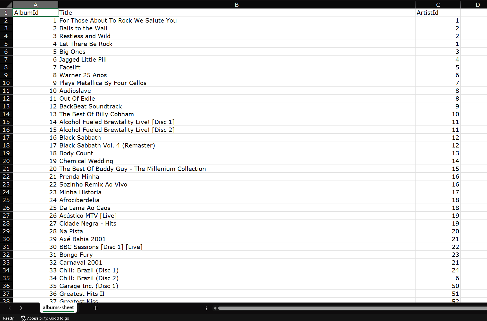
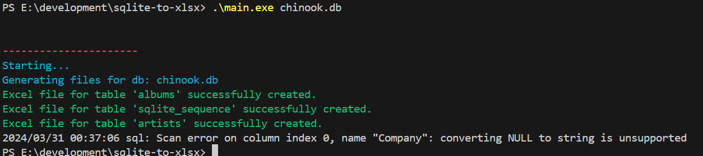
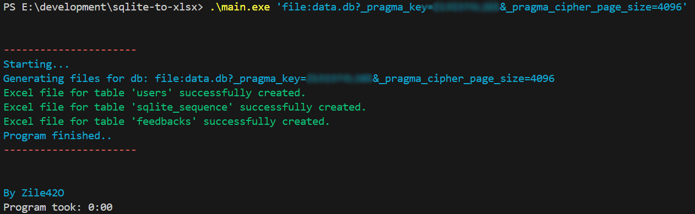

# sqlite-to-xlsx

### Usage

Simple golang program, xlsx files will be into `out` folder

### Build
```
go build
```
### Run
```
go run main <db-path.db>
```
Or (if you did build)
```
./main.exe <db-path.db>
```


<hr>

### Demo Excel (Well formating) [output] 


### Demo Default [output] 


### Used example .db is from [Site](https://www.sqlitetutorial.net/sqlite-sample-database/)

<hr>

### Demo Cipher Supported [output] 

